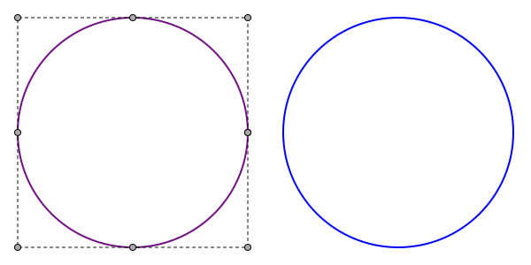
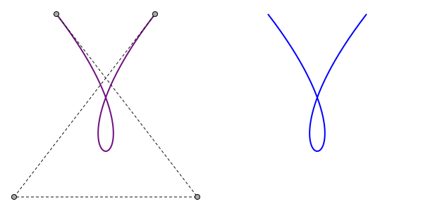
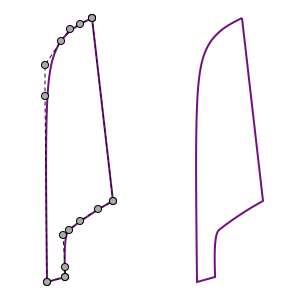

# `capstan`

NURBS utilities in Rust.

## NURBS Curve Evaluation

Currently, only NURBS curve evaluation is complete. The evaluation uses a
naive version of the de Boor algorithm. With this, it's possible to evaluate
the 3D coordinates of a NURBS curve at any parameter value.

NURBS can represent conics with floating-point precision. This image shows a
tesselated NURBS circle on the left and an SVG circle on the right:

NURBS are a generalization of Bézier curves, so they can exactly represent any
order of Bézier curve. The image below shows an SVG cubic Bézier with a loop on
the right and a tesselated NURBS representation on the left:

NURBS can represent multiple Bézier curve segments in a single curve. The
example below shows an outline of the Egyptian "reed leaf" hieroglyph
(Gardiner sign M17). This curve is constructed from 2 line segments and 4
cubic Bézier curves, all of which can be represented as a single closed
NURBS curve:

## NURBS Curve Representation

The library uses the "Rhino" form of NURBS curves, where there are two fewer
knots than in "traditional" NURBS.
